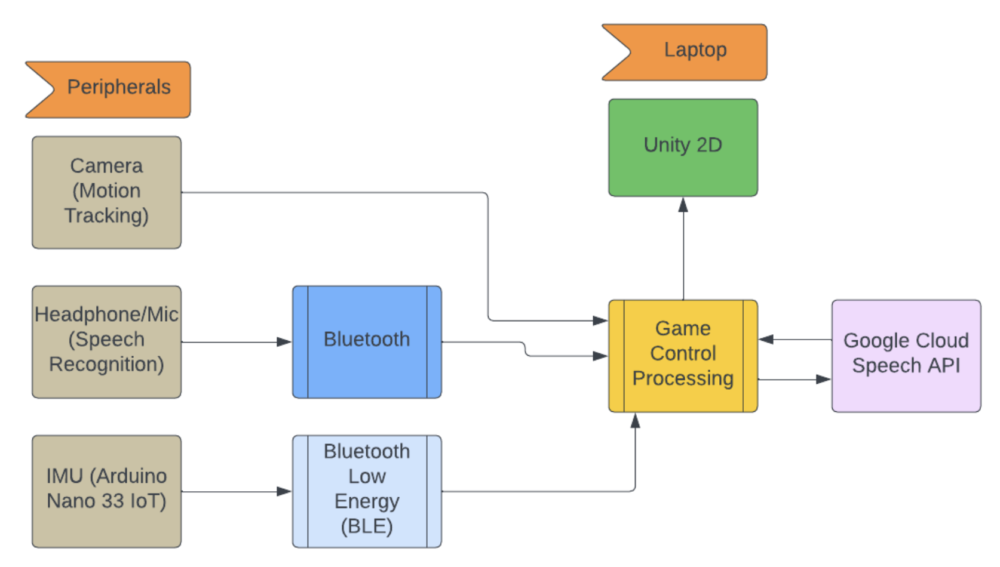

# Team-5: Bruin Brawlers

From the gladiatorial arenas of ancient Rome to the pixelated battlegrounds of early arcade cabinets, the allure of hand-to-hand combat has been embedded in the DNA of gaming since its inception. Fighting games, standing as some of the earliest forms of interactive entertainment, have evolved over centuries, captivating audiences with the primal thrill of true combat. The driving force behind our project is the desire to create a gaming environment that goes beyond conventional interfaces, providing players with a truly immersive experience. By incorporating speech and gesture recognition technologies, we aim to bridge the gap between the physical and virtual worlds, opening up new possibilities for strategy and skill expression.

Our project aspires to tell a story of innovation, pushing the boundaries to create a gaming experience that is not only entertaining but also transformative. We wish to redefine the standard for PvP fighting games and leverage the capabilities of technology to create a seamless and more immersive gaming experience. This game serves as a fun throwback to the days of local co-op and simple fighting games.

_A high level dirgram showcasing the major components of our project_

### A. Graphic Design

At the core of our game's development is the Unity 2D game engine, renowned for its user-friendly interface and flexibility, making it an ideal choice for developers with varying levels of experience. The Unity engine will enable us to create vivid, engaging 2D environments and characters that draw inspiration from iconic fighting games like Street Fighter and Mortal Kombat.

The graphical aspect of our game will focus on delivering smooth animations and responsive gameplay, which are crucial for a fighting game's success. We will implement advanced state management to track player health points (HP) and super ability charge meters, ensuring that each match is dynamic and every player action is impactful. Collision detection will play a pivotal role in our game mechanics, allowing us to accurately register hits and execute combos, adding depth and strategy to the combat system.
As a contingency plan, we will also consider Pygame for simpler graphical tasks or as a fallback solution. Pygame, being a set of Python modules designed for writing video games, offers us an alternative route for simpler 2D game development, should we encounter specific challenges within Unity.

### B. Speech Recognition

To bring an innovative twist to the execution of special moves and transformations, our game will incorporate speech recognition technology. Players will be able to activate unique abilities and execute complex moves through voice commands. This feature will be facilitated by a paired microphone setup, designed to distinguish between players' voices, ensuring that commands are accurately attributed to the correct player in the heat of battle.

For the processing and recognition of voice commands, we will utilize the Google Cloud Speech API. This choice is motivated by the API's high accuracy, low latency, and its ability to understand a wide range of languages and accents. The integration of speech recognition aims to create a more immersive and interactive gaming experience, allowing players to feel truly connected to their characters and actions on screen.
### C. Gesture Recognition
For gesture recognition, our system will utilize a combination of Inertial Measurement Units (IMUs) and camera feeds to capture player movements like punches, kicks, and blocks. IMU will track motion dynamics, such as acceleration, to assess the intensity of actions, directly influencing in-game damage levels for a realistic fighting experience. Concurrently, camera will provide visual context, enhancing gesture interpretation.

To classify these gestures, we will employ Convolutional Neural Networks (CNNs), trained on a dataset of player movements. These models excel in recognizing complex patterns, associating specific gesture signatures from IMU and camera data with corresponding in-game actions. This setup would not only allow for a wide range of moves to be accurately recognized but also enable the game to adjust attack effectiveness based on the physical exertion behind each gesture.
Implementing real-time processing algorithms, we will ensure minimal latency between real-world actions and virtual outcomes, maintaining game responsiveness and immersion. This integration of IMUs, cameras, and machine learning will create a dynamic gameplay experience where players' physical efforts are directly mirrored in the game, adding depth and strategy to the combat system.

### D. Player Localization

To accurately track player positioning and movement within the physical play area, we propose the use of a brightly colored waist band for each player. This method will allow our camera-based system to easily identify and follow the players' movements, effectively translating their forward and backward motions into corresponding movements of their in-game characters.

The waist band concept is designed to provide a simple yet effective solution for player localization, ensuring that the game accurately reflects the players' positioning and movements in real time. This feature is crucial for maintaining the immersive and interactive nature of the game, allowing players to move freely within the play area while still having their actions accurately represented in the virtual environment.
